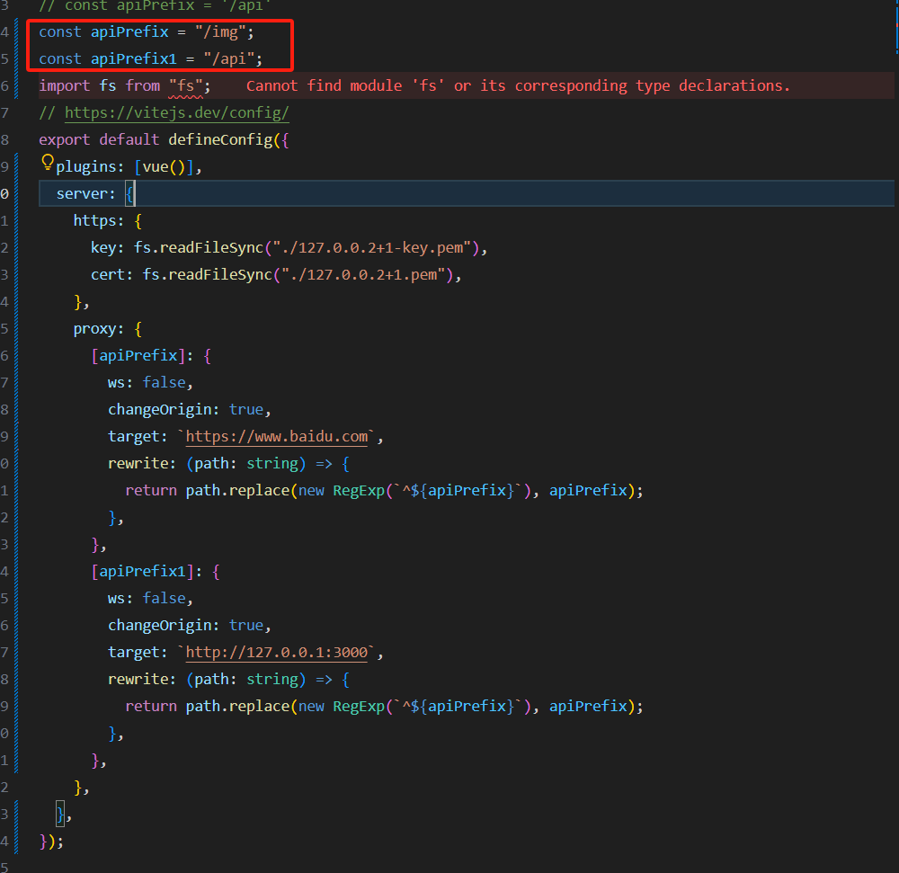
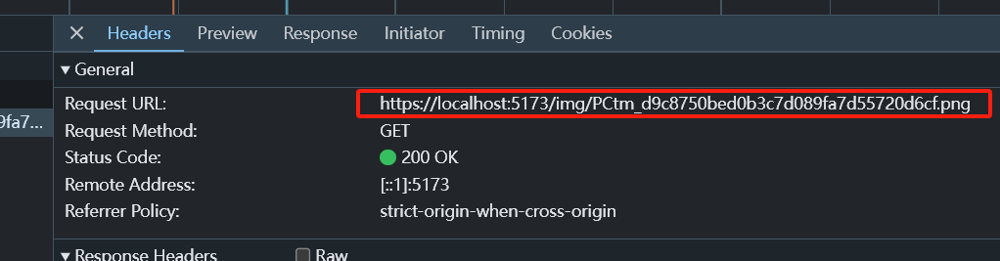
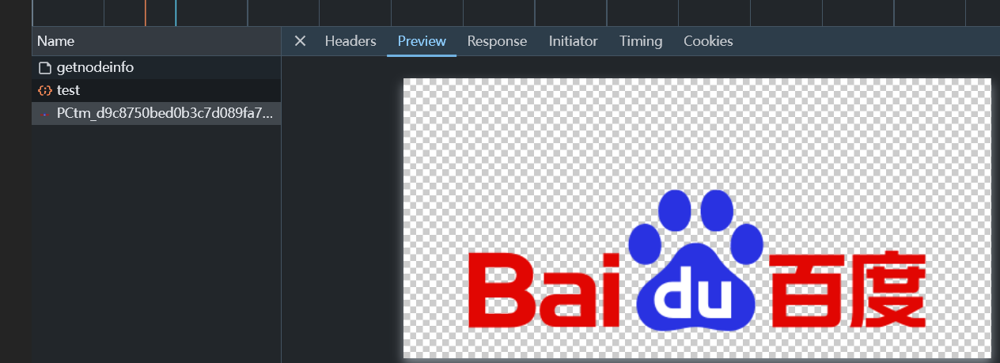
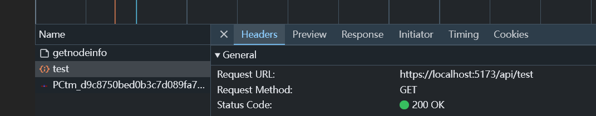
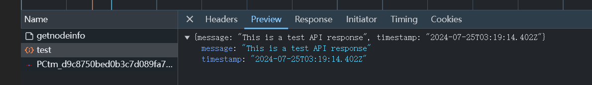
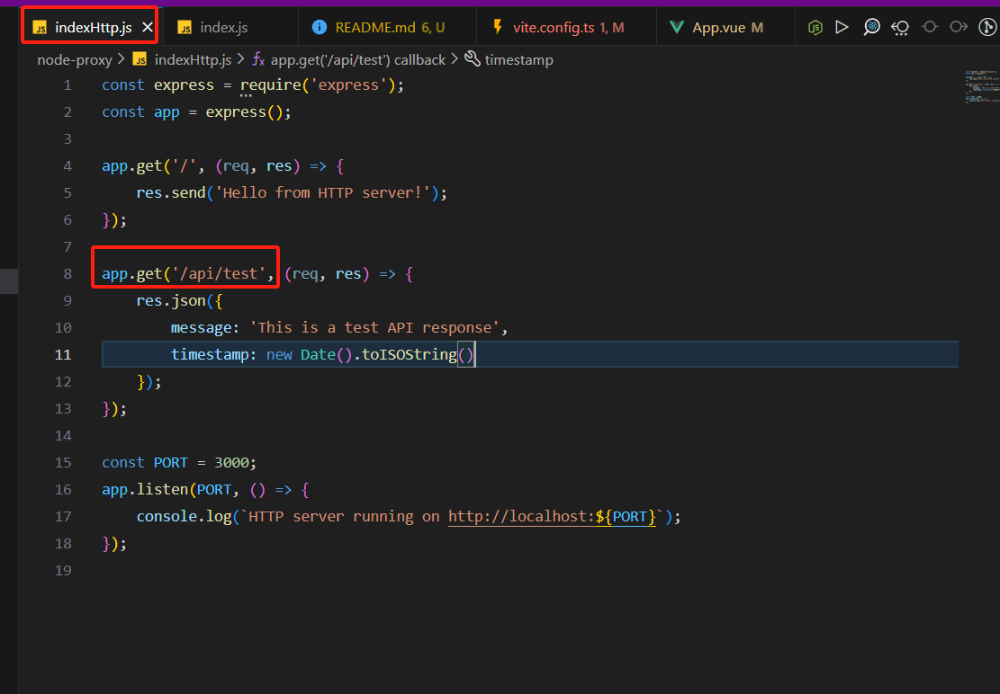

# vite + nodejs  

vite 本地直接访问 https 可以代理到 http 的 demo
node 版本 v16.20.1

## 项目结构

- `vite-demo/`: 前端 Vite 项目
- `node-proxy/`: 后端 Node.js 服务
  - `indexHttp.js`: HTTP 服务相关功能
  - `index.js`: HTTPS 服务

## Setup

1. 克隆项目到本地：

```bash
git clone https://github.com/kmq116/vite-https-proxy.git
```

2. 安装前后端项目依赖：

前端

```bash
cd vite-demo
pnpm i
```

后端

```bash
cd node-proxy
pnpm i
```

## 运行项目

1. 启动前端开发服务器：
在项目根目录执行

```bash
cd vite-demo
npm run dev
```

2. 启动后端服务：
在项目根目录执行

```bash
cd node-proxy
node indexHttp.js
```

## 效果

vite.config.ts 文件下

1. 第一个代理规则 ([apiPrefix]):  

所有以 "/img" 开头的请求都会被代理。
目标是 <https://www.baidu.com>
它会改写请求路径，保持 "/img" 前缀。  

2. 第二个代理规则 ([apiPrefix1]):

所有以 "/api" 开头的请求都会被代理。  
目标是本地服务器 <http://127.0.0.1:3000>


可以看到这个访问，最后指向了百度的图片



请求本地 api/test 的接口，指向了本地的 nodejs http 接口，说明代理生效



